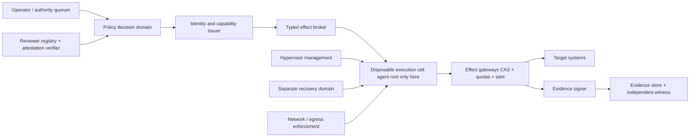

# Architecture and Trust-Boundary Diagram

**DRAFT — NON-CANONICAL — NOT AUTHORIZED FOR DEPLOYMENT**

Trust boundaries are administrative as well as network boundaries. The guest
cannot reach policy keys, issuer keys, reviewer state, evidence custody,
hypervisor management, backup keys, or recovery credentials. Every gateway
request is bound to a mission, delegation lineage, plan hash, target version,
data mode, quota, nonce, and expiry. Policy loss, attestation drift, stale
state, partition, clock failure, or evidence-sink failure defaults to no
external write.
