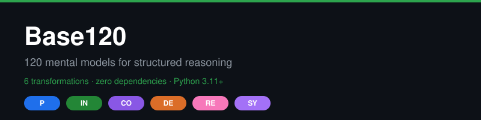

# Base120




**120 named mental models for structured reasoning — a stdlib-only Python library.**

**Version 2.0.0** · [Changelog](CHANGELOG.md) · [PyPI](https://pypi.org/project/base120/) · [Documentation](docs/) · [Examples](examples/) · [Contributing](CONTRIBUTING.md)

Use them to analyze problems, design systems, and make decisions — whether you are a human, an AI agent, or a fleet of both.

[](LICENSE)
[]()
[]()
[](https://www.python.org/downloads/)
[]()
[](https://github.com/hummbl-io/oss/actions/workflows/ci.yml)
[](https://pypi.org/project/base120/)
[](CODE_OF_CONDUCT.md)
[](SECURITY.md)

---

## Quick Start

```bash
pip install base120
```

```python
from base120 import Engine

engine = Engine()
operator = engine.get("P6")
print(operator.name)  # → Point-of-View Anchoring

prompt = engine.prompt("P6", "How should we price the certification tier?")
print(prompt)
```

That's it. Zero dependencies. No network calls. No telemetry. Just 120 reasoning primitives you can call from any Python 3.11+ environment.

---

## Table of Contents

- [What is Base120?](#what-is-base120)
- [The 6 Transformation Families](#the-6-transformation-families)
- [The 120 Models](#the-120-models)
- [Installation](#installation)
- [Python SDK](#python-sdk)
- [CLI](#cli)
- [MCP Server](#mcp-server)
- [Ledger](#ledger)
- [Examples](#examples)
- [Why Base120?](#why-base120)
- [Comparison](#comparison)
- [Consuming the Registry](#consuming-the-registry)
- [Documentation](#documentation)
- [Contributing](#contributing)
- [License](#license)

---

## What is Base120?

Base120 is a **canonical registry of 120 mental models** organized into 6 transformation families, with a stdlib-only Python SDK for programmatic access.

Each model is a **named, versioned reasoning primitive** — not a vague platitude, but a specific operator you can apply to a problem, generate a prompt from, and persist a governance-readable record of.

### Design Principles

- **Stdlib-only**: Zero third-party runtime dependencies. The entire library runs on Python 3.11+ with no installs beyond `pip install base120`.
- **Deterministic**: Same input, same output. No LLM calls, no network, no randomness. Every operator lookup is reproducible.
- **Tuple-native**: Every operator application produces a JSONL tuple you can persist to an append-only ledger.
- **Agent-friendly**: Works with Claude Code, Codex, Cursor, Copilot, and any MCP-compatible agent via the `base120-mcp` entry point.
- **Human-friendly**: The CLI and Python API are equally usable by a human in a terminal and an AI agent in a pipeline.
- **Frozen canon**: The 120-model registry is versioned and frozen. Implementations in other languages conform to this registry.

### What Base120 is NOT

- **Not an LLM**: Base120 doesn't call models. It provides the reasoning structure; you provide the intelligence (human or AI).
- **Not a prompt library**: Base120 generates operator-specific prompts, but the operators themselves are the value — structured reasoning primitives, not canned text.
- **Not a framework**: No base classes to inherit, no decorators to apply, no middleware to configure. Import, call, done.
- **Not a SaaS**: No API keys, no rate limits, no vendor lock-in. The registry is a YAML file you can read with any language.

---

## The 6 Transformation Families

Base120 organizes mental models into 6 families based on the type of cognitive transformation they perform:

| Family | Code | Focus | Question it answers | Example Models |
|--------|------|-------|---------------------|----------------|
| **Perspective** | P | Viewpoints, framing, empathy | "How else can I see this?" | P1 First Principles, P5 Empathy Mapping, P10 Context Windowing |
| **Inversion** | IN | Counterfactuals, negation, contradiction | "What if the opposite is true?" | IN1 Reductio ad Absurdum, IN5 Worst-Case Analysis, IN6 Pre-Mortem |
| **Composition** | CO | Building, combining, layering | "How do I assemble this from parts?" | CO1 Modularity, CO5 Interface Design, CO10 Protocol Layering |
| **Decomposition** | DE | Breaking down, isolating, factoring | "What are the pieces?" | DE1 Root Cause Analysis, DE5 Separation of Concerns, DE8 Dimensional Reduction |
| **Recursion** | RE | Self-reference, iteration, meta-reasoning | "How does this feed back on itself?" | RE1 Feedback Loop, RE5 Recursion, RE8 Self-Reference |
| **Systems** | SY | Dynamics, emergence, control | "How does the whole behave?" | SY1 Causal Loop Diagrams, SY13 Reinforcing Feedback, SY18 Resilience Engineering |

### Why 6 families?

Most mental-models resources present a flat list of 50-100 models with no structure. Base120's 6-family taxonomy gives you:

- **A navigation map**: Know which family to reach for based on the type of thinking you need.
- **A completeness check**: Each family has 18-20 models, so you can tell when you've exhausted a mode of thinking.
- **A composition grammar**: Families chain naturally — Perspective → Inversion → Decomposition → Composition → Recursion → Systems is a common decision-making arc.

### Family deep dives

- [Perspective (P)](#domain-p--perspective-p1p18) — 18 operators for viewpoints, framing, and empathy
- [Inversion (IN)](#domain-in--inversion-in1in18) — 18 operators for counterfactuals, negation, and contradiction
- [Composition (CO)](#domain-co--composition-co1co20) — 20 operators for building, combining, and layering
- [Decomposition (DE)](#domain-de--decomposition-de1de20) — 20 operators for breaking down, isolating, and factoring
- [Recursion (RE)](#domain-re--recursion-re1re20) — 20 operators for self-reference, iteration, and meta-reasoning
- [Systems (SY)](#domain-sy--systems-sy1sy20) — 20 operators for dynamics, emergence, and control

---

## The 120 Models

<details>
<summary><strong>Click to expand the full model list</strong></summary>

### Domain P — Perspective (P1–P18)

- P1 First Principles Framing
- P2 Stakeholder Mapping
- P3 Identity Stack
- P4 Lens Shifting
- P5 Empathy Mapping
- P6 Point-of-View Anchoring
- P7 Perspective Switching
- P8 Narrative Framing
- P9 Cultural Lens Shifting
- P10 Context Windowing
- P11 Role Perspective-Taking
- P12 Temporal Framing
- P13 Spatial Framing
- P14 Reference Class Framing
- P15 Assumption Surfacing
- P16 Identity-Context Reciprocity
- P17 Frame Control & Reframing
- P18 Horizon Scanning

### Domain IN — Inversion (IN1–IN18)

- IN1 Reductio ad Absurdum
- IN2 Proof by Contradiction
- IN3 Negation Testing
- IN4 Counterfactual Reasoning
- IN5 Worst-Case Analysis
- IN6 Pre-Mortem
- IN7 Regret Minimization
- IN8 Inversion Principle
- IN9 Constraint Relaxation
- IN10 Opposite Thinking
- IN11 Devil's Advocate
- IN12 Second-Order Negation
- IN13 Assumption Violation
- IN14 Boundary Stressing
- IN15 Failure Mode Enumeration
- IN16 Adversarial Generation
- IN17 Exclusion Analysis
- IN18 Complement Thinking

### Domain CO — Composition (CO1–CO20)

- CO1 Modularity
- CO2 Abstraction
- CO3 Encapsulation
- CO4 Interface Design
- CO5 Protocol Layering
- CO6 Dependency Injection
- CO7 Pipeline Construction
- CO8 Orchestration
- CO9 Service Composition
- CO10 Microservice Decomposition
- CO11 Event-Driven Architecture
- CO12 API Gateway Pattern
- CO13 Federation
- CO14 Polyglot Persistence
- CO15 CQRS
- CO16 Event Sourcing
- CO17 Saga Pattern
- CO18 Strangler Fig Pattern
- CO19 Sidecar Pattern
- CO20 Ambassador Pattern

### Domain DE — Decomposition (DE1–DE20)

- DE1 Root Cause Analysis
- DE2 Five Whys
- DE3 Fault Tree Analysis
- DE4 Fishbone Diagram
- DE5 Separation of Concerns
- DE6 Dimensional Reduction
- DE7 Factor Analysis
- DE8 Principal Component Analysis
- DE9 Feature Extraction
- DE10 Domain-Driven Design
- DE11 Bounded Context
- DE12 Aggregate Decomposition
- DE13 Entity-Relationship Modeling
- DE14 Normalization
- DE15 Refactoring
- DE16 Extract Method
- DE17 Decompose Conditional
- DE18 Replace Inheritance
- DE19 Split Phase
- DE20 Replace Algorithm

### Domain RE — Recursion (RE1–RE20)

- RE1 Feedback Loop
- RE2 Recursion
- RE3 Iteration
- RE4 Self-Reference
- RE5 Meta-Reasoning
- RE6 Reflection
- RE7 Introspection
- RE8 Bootstrapping
- RE9 Self-Modification
- RE10 Auto-Tuning
- RE11 Meta-Learning
- RE12 Transfer Learning
- RE13 Curriculum Learning
- RE14 Active Learning
- RE15 Reinforcement Learning
- RE16 Q-Learning
- RE17 Policy Gradient
- RE18 Actor-Critic
- RE19 Multi-Agent Reinforcement
- RE20 Hierarchical Reinforcement

### Domain SY — Systems (SY1–SY20)

- SY1 Causal Loop Diagrams
- SY2 Stock and Flow
- SY3 Systems Archetypes
- SY4 Leverage Points
- SY5 Tragedy of the Commons
- SY6 Fixes That Fail
- SY7 Shifting the Burden
- SY8 Eroding Goals
- SY9 Escalation
- SY10 Success to the Successful
- SY11 Limits to Growth
- SY12 Balancing Feedback
- SY13 Reinforcing Feedback
- SY14 Homeostasis
- SY15 Resilience
- SY16 Antifragility
- SY17 Optionality
- SY18 Redundancy
- SY19 Diversity
- SY20 Modularity

</details>

**Total: 120 models.** Full registry in [`Base120_Canonical_Model_Registry.yaml`](Base120_Canonical_Model_Registry.yaml).

---

## Installation

### From PyPI

```bash
pip install base120
```

### From source

```bash
git clone https://github.com/hummbl-io/oss.git && cd oss/packages/base120
pip install -e ".[test]"
```

### Requirements

- Python 3.11+
- Zero runtime dependencies (stdlib only)

---

## Python SDK

### Core API

```python
from base120 import Engine, Ledger

engine = Engine()

# Look up an operator by ID
operator = engine.get("P6")
print(operator.name)        # → Point-of-View Anchoring
print(operator.family)      # → P (Perspective)
print(operator.description) # → Anchor analysis to a specific viewpoint

# Generate an operator-specific prompt for a problem
prompt = engine.prompt("P6", "How should we price the certification tier?")
print(prompt)

# Apply an operator and persist a governance-readable record
result = engine.record(
    "P6",
    "How should we price the certification tier?",
    "Anchor the offer to the compliance officer's risk budget.",
    0.85,  # confidence score
)

# Persist to an append-only ledger
ledger = Ledger("base120-ledger.jsonl")
ledger.append(result.to_tuple())
```

### Engine methods

| Method | Returns | Description |
|--------|---------|-------------|
| `engine.get(operator_id)` | `Operator` | Look up a single operator by ID (e.g., `"P6"`) |
| `engine.list()` | `list[Operator]` | List all 120 operators |
| `engine.families()` | `dict` | List the 6 transformation families |
| `engine.prompt(operator_id, problem)` | `str` | Generate an operator-specific prompt for a problem |
| `engine.record(operator_id, problem, response, confidence)` | `Result` | Apply an operator and produce a ledger tuple |

### Operator attributes

| Attribute | Type | Description |
|-----------|------|-------------|
| `operator.id` | `str` | The operator code (e.g., `"P6"`) |
| `operator.name` | `str` | Human-readable name (e.g., `"Point-of-View Anchoring"`) |
| `operator.family` | `str` | The transformation family (e.g., `"P"`) |
| `operator.description` | `str` | What the operator does |

---

## CLI

```bash
# List all 120 operators
base120 list

# Inspect one operator
base120 get P6

# Generate an operator-specific prompt for a problem
base120 prompt P6 "How should we price the certification tier?"

# List the 6 transformation families
base120 families
```

### CLI examples

```bash
$ base120 get IN6
ID:          IN6
Name:        Pre-Mortem
Family:      IN (Inversion)
Description: Imagine the project has failed; work backward to identify causes

$ base120 prompt IN6 "Should we migrate from REST to GraphQL?"
# Generates a pre-mortem prompt: "Assume the migration has shipped and
# failed catastrophically. What went wrong? List the top 5 failure modes
# and their early-warning signals."
```

---

## MCP Server

Base120 ships with an MCP (Model Context Protocol) server entry point, so any MCP-compatible agent can use the 120 operators directly:

```bash
# Run the MCP server
base120-mcp
```

Learn more about MCP at the [Model Context Protocol specification](https://modelcontextprotocol.io/).

### Configuration for Claude Code

Add to your [Claude Code](https://docs.anthropic.com/en/docs/claude-code) MCP config:

```json
{
  "mcpServers": {
    "base120": {
      "command": "base120-mcp"
    }
  }
}
```

### Configuration for Cursor

Add to your [Cursor](https://docs.cursor.com/context/model-context-protocol) MCP config:

```json
{
  "mcpServers": {
    "base120": {
      "command": "base120-mcp"
    }
  }
}
```

Once configured, your agent can call `base120.get`, `base120.list`, `base120.prompt`, and `base120.families` as MCP tools.

---

## Ledger

Every operator application can be persisted as a JSONL tuple to an append-only ledger:

```python
from base120 import Engine, Ledger

engine = Engine()
ledger = Ledger("decisions.jsonl")

# Apply an operator and record the result
result = engine.record(
    "DE1",                                    # operator ID
    "Reduce release risk.",                   # problem
    "Split blockers by owner.",               # response
    0.9,                                      # confidence
)

ledger.append(result.to_tuple())

# Query high-drift records (confidence < threshold)
high_drift = ledger.cut(0.5)
for record in high_drift:
    print(record)
```

### Ledger tuple format

Each ledger entry is a JSONL tuple with:

- `operator_id`: The operator code (e.g., `"DE1"`)
- `problem`: The problem statement
- `response`: The applied response
- `confidence`: Float 0.0–1.0
- `timestamp`: ISO 8601 timestamp

The ledger is append-only — records are never modified or deleted, making it suitable for audit trails and governance review.

---

## Examples

### Example 1: Structured Decision-Making

**Problem**: "Should we migrate from REST to GraphQL?"

```python
from base120 import Engine

engine = Engine()

# Step 1 — P1 (First Principles): What are the irreducible requirements?
print(engine.prompt("P1", "Should we migrate from REST to GraphQL?"))
# → "What are the irreducible requirements? Latency, cacheability, client flexibility."

# Step 2 — IN5 (Worst-Case Analysis): What if the migration takes 6 months?
print(engine.prompt("IN5", "Should we migrate from REST to GraphQL?"))
# → "What if the migration takes 6 months and breaks mobile clients?"

# Step 3 — DE5 (Separation of Concerns): Which parts need flexibility?
print(engine.prompt("DE5", "Should we migrate from REST to GraphQL?"))
# → "Which parts of the API actually need flexibility? Read paths vs write paths."

# Step 4 — CO1 (Modularity): Can we support both during transition?
print(engine.prompt("CO1", "Should we migrate from REST to GraphQL?"))
# → "Can we support both during transition? BFF pattern, not big-bang."

# Step 5 — SY13 (Feedback Loops): How do we know it's working?
print(engine.prompt("SY13", "Should we migrate from REST to GraphQL?"))
# → "How do we know it's working? Metrics: latency p99, error rate, client adoption."
```

Each step names the model, applies it, and passes output to the next. No vague advice — explicit reasoning with receipts.

### Example 2: Pre-Mortem for a Launch

```python
from base120 import Engine, Ledger

engine = Engine()
ledger = Ledger("launch-premortem.jsonl")

# Run a pre-mortem on the launch plan
result = engine.record(
    "IN6",                                          # Pre-Mortem
    "Launch the new pricing tier next Monday.",     # problem
    "Top failure mode: existing customers downgrade to the new tier, cannibalizing revenue.",
    0.8,                                            # confidence
)

ledger.append(result.to_tuple())
print("Pre-mortem recorded. Review before launch.")
```

### Example 3: Multi-Agent Reasoning

```python
from base120 import Engine

engine = Engine()

# An AI agent applies Perspective operators to gather viewpoints
viewpoints = [engine.prompt(f"P{i}", "Design a rate limiter") for i in [1, 5, 6, 10]]

# Then applies Inversion to stress-test
failure_modes = [engine.prompt(f"IN{i}", "Design a rate limiter") for i in [5, 6, 15]]

# Then applies Systems to understand dynamics
dynamics = [engine.prompt(f"SY{i}", "Design a rate limiter") for i in [1, 12, 13]]
```

### Example 4: Reading the Registry Directly (Any Language)

The canonical registry is a YAML file — you can read it from any language without installing Base120:

```python
import yaml  # any YAML parser

with open("Base120_Canonical_Model_Registry.yaml") as f:
    registry = yaml.safe_load(f)

models = {m["id"]: m for m in registry["models"]}
print(models["P1"]["name"])   # → First Principles Framing
print(models["IN6"]["name"])  # → Inverse/Proof by Contradiction
print(models["SY13"]["name"]) # → Incentive Architecture
```

```javascript
// Node.js
import yaml from 'js-yaml';
import { readFileSync } from 'fs';

const registry = yaml.load(readFileSync('Base120_Canonical_Model_Registry.yaml', 'utf8'));
const models = Object.fromEntries(registry.models.map(m => [m.id, m]));
console.log(models.P1.name);   // → First Principles Framing
```

```rust
// Rust (using serde_yaml)
let registry: serde_yaml::Value = serde_yaml::from_str(&std::fs::read_to_string("Base120_Canonical_Model_Registry.yaml")?)?;
let models = registry["models"].as_sequence().unwrap();
```

---

## Why Base120?

### The problem with existing mental-models resources

Most mental-models resources fall into one of three categories:

| Domain | Code | Focus | Example Models |
|--------|------|-------|----------------|
| **Perspective** | P | Viewpoints, framing, empathy, context | P1 First Principles Framing, P11 Role Perspective-Taking, P20 Worldview Articulation |
| **Inversion** | IN | Counterfactuals, negation, proof by contradiction | IN1 Subtractive Thinking, IN11 Devil's Advocate Protocol, IN20 Antigoals & Anti-Patterns Catalog |
| **Composition** | CO | Building, combining, layering | CO1 Synergy Principle, CO11 Pattern Composition (Tiling), CO20 Holistic Integration |
| **Decomposition** | DE | Breaking down, isolating, factoring | DE1 Root Cause Analysis (5 Whys), DE11 Scope Delimitation, DE20 Partition-and-Conquer |
| **Recursion** | RE | Self-reference, iteration, meta-reasoning | RE1 Recursive Improvement (Kaizen), RE11 Calibration Loops, RE20 Recursive Governance (Guardrails that Learn) |
| **Systems** | SY | Dynamics, emergence, control | SY1 Leverage Points, SY11 Governance Patterns, SY20 Systems-of-Systems Coordination |

Base120 fills the structural hole: **a general-purpose Python library** with a structured taxonomy, stdlib-only design, and multi-surface delivery (Python SDK + CLI + MCP + REST).

### What you get

- **120 operators** — the largest catalog among general-purpose mental-models libraries
- **6-family taxonomy** — structured navigation, not a flat list
- **Zero dependencies** — installs in seconds, runs anywhere Python 3.11+ runs
- **Deterministic** — same input, same output, every time
- **Agent-native** — MCP server built in, works with Claude Code, Cursor, Codex, Copilot
- **Human-native** — CLI and Python API equally usable
- **Ledger-native** — every application persists a governance-readable record
- **Frozen canon** — the registry is versioned and frozen; other-language implementations conform to it

```
Step 1 — P1 (First Principles Framing):
  What are the irreducible requirements? Latency, cacheability, client flexibility.

Step 2 — IN5 (Negative Space Framing):
  What is absent from the current architecture? What gaps does REST leave unaddressed?

Step 3 — DE5 (Dimensional Reduction):
  Which dimensions actually matter? Read paths vs write paths, client types, payload size.

Step 4 — CO1 (Synergy Principle):
  Can we support both during transition? BFF pattern, not big-bang.

Step 5 — SY13 (Incentive Architecture):
  How do we know it's working? Metrics: latency p99, error rate, client adoption.
```

### Implementing in another language

The registry is language-agnostic. To implement Base120 in Rust, Go, TypeScript, etc.:

1. Parse `Base120_Canonical_Model_Registry.yaml` with any YAML parser
2. Implement the 4 `Engine` methods: `get`, `list`, `families`, `prompt`
3. Implement the `Ledger` for append-only JSONL persistence
4. Validate against the test corpus in `tests/`

### Domain P — Perspective (P1–P20)

P1 First Principles Framing | P2 Stakeholder Mapping | P3 Identity Stack | P4 Lens Shifting | P5 Empathy Mapping | P6 Point-of-View Anchoring | P7 Perspective Switching | P8 Narrative Framing | P9 Cultural Lens Shifting | P10 Context Windowing | P11 Role Perspective-Taking | P12 Temporal Framing | P13 Spatial Framing | P14 Reference Class Framing | P15 Assumption Surfacing | P16 Identity-Context Reciprocity | P17 Frame Control & Reframing | P18 Boundary Object Selection | P19 Sensemaking Canvases | P20 Worldview Articulation

### Domain IN — Inversion (IN1–IN20)

IN1 Subtractive Thinking | IN2 Premortem Analysis | IN3 Problem Reversal | IN4 Contra-Logic | IN5 Negative Space Framing | IN6 Inverse/Proof by Contradiction | IN7 Boundary Testing | IN8 Contrapositive Reasoning | IN9 Backward Induction | IN10 Red Teaming | IN11 Devil's Advocate Protocol | IN12 Failure First Design | IN13 Opportunity Cost Focus | IN14 Second-Order Effects (Inverted) | IN15 Constraint Reversal | IN16 Inverse Optimization | IN17 Counterfactual Negation | IN18 Kill-Criteria & Stop Rules | IN19 Harm Minimization (Via Negativa) | IN20 Antigoals & Anti-Patterns Catalog

### Domain CO — Composition (CO1–CO20)

CO1 Synergy Principle | CO2 Chunking | CO3 Functional Composition | CO4 Interdisciplinary Synthesis | CO5 Emergence | CO6 Gestalt Integration | CO7 Network Effects | CO8 Layered Abstraction | CO9 Interface Contracts | CO10 Pipeline Orchestration | CO11 Pattern Composition (Tiling) | CO12 Modular Interoperability | CO13 Cross-Domain Analogy | CO14 Platformization | CO15 Combinatorial Design | CO16 System Integration Testing | CO17 Orchestration vs Choreography | CO18 Knowledge Graphing | CO19 Multi-Modal Integration | CO20 Holistic Integration

### Domain DE — Decomposition (DE1–DE20)

DE1 Root Cause Analysis (5 Whys) | DE2 Factorization | DE3 Modularization | DE4 Layered Breakdown | DE5 Dimensional Reduction | DE6 Taxonomy/Classification | DE7 Pareto Decomposition (80/20) | DE8 Work Breakdown Structure | DE9 Signal Separation | DE10 Abstraction Laddering | DE11 Scope Delimitation | DE12 Constraint Isolation | DE13 Failure Mode Analysis (FMEA) | DE14 Variable Control & Isolation | DE15 Decision Tree Expansion | DE16 Hypothesis Disaggregation | DE17 Orthogonalization | DE18 Scenario Decomposition | DE19 Critical Path Unwinding | DE20 Partition-and-Conquer

### Domain RE — Recursion (RE1–RE20)

RE1 Recursive Improvement (Kaizen) | RE2 Feedback Loops | RE3 Meta-Learning (Learn-to-Learn) | RE4 Nested Narratives | RE5 Fractal Reasoning | RE6 Recursive Framing | RE7 Self-Referential Logic | RE8 Bootstrapping | RE9 Iterative Prototyping | RE10 Compounding Cycles | RE11 Calibration Loops | RE12 Bayesian Updating in Practice | RE13 Gradient Descent Heuristic | RE14 Spiral Learning | RE15 Convergence-Divergence Cycling | RE16 Retrospective -> Prospective Loop | RE17 Versioning & Diff | RE18 Anti-Catastrophic Forgetting | RE19 Auto-Refactor | RE20 Recursive Governance (Guardrails that Learn)

### Domain SY — Systems (SY1–SY20)

SY1 Leverage Points | SY2 System Boundaries | SY3 Stocks & Flows | SY4 Requisite Variety | SY5 Systems Archetypes | SY6 Feedback Structure Mapping | SY7 Path Dependence | SY8 Homeostasis/Dynamic Equilibrium | SY9 Phase Transitions & Tipping Points | SY10 Causal Loop Diagrams | SY11 Governance Patterns | SY12 Protocol/Interface Standards | SY13 Incentive Architecture | SY14 Risk & Resilience Engineering | SY15 Multi-Scale Alignment | SY16 Ecosystem Strategy | SY17 Policy Feedbacks | SY18 Measurement & Telemetry | SY19 Meta-Model Selection | SY20 Systems-of-Systems Coordination
</details>


```bash
git clone https://github.com/hummbl-io/oss.git && cd oss/packages/base120
pip install -e ".[test]"
python -m pytest tests/ -v
```

The canonical package name is `base120` (published on PyPI as `base120` v2.0.0).

## CLI

```bash
# List all operators
base120 list

# Inspect one operator
base120 get P6

# Generate an operator-specific prompt for a problem
base120 prompt P6 "How should we price the certification tier?"

# List canonical operator families
base120 families

# Verify README.md and llms.txt match the canonical registry
base120 verify-docs
```

## Ledger

Persist operator applications as JSONL tuples:

```python
from base120 import Engine, Ledger

engine = Engine()
result = engine.record("DE1", "Reduce release risk.", "Split blockers by owner.", 0.9)

ledger = Ledger()
ledger.append(result.to_tuple())
high_drift = ledger.cut(0.5)
```

## Authority Statement

This repository is the **authoritative source** for the Base120 v1 registry,
reference artifacts, and current Python v2 SDK. Other language
implementations should conform to the frozen registry and corpus artifacts
defined here. The `2.0.0` Python SDK API remains source-install only until a
package distribution is published.

### v1 Artifact Policy

- **Permitted:** Security fixes, CI hardening, documentation, corpus additions
- **Prohibited:** Schema changes, registry modifications, breaking changes

### Change Classes

| Changing... | Class | Review |
|-------------|-------|--------|
| Typos, formatting | Trivial | CODEOWNER only |
| Documentation | Editorial | CODEOWNER only |
| Test corpus | Corpus | CODEOWNER + tests |
| Schemas | Schema | 1+ reviewers |
| Formal models | FM | 2+ reviewers |

## HUMMBL Ecosystem

Base120 is part of the [HUMMBL](https://hummbl.io) cognitive AI architecture:

- [hummbl-governance](https://github.com/hummbl-io/oss/tree/main/packages/hummbl-governance) — Governance runtime (kill switch, circuit breaker, cost governor)
- [arbiter](https://github.com/hummbl-io/arbiter) — Agent-aware code quality scoring and attribution
- [hummbl-bibliography](https://github.com/hummbl-io/hummbl-bibliography) — Bibliography for the HUMMBL cognitive framework

---

## License

Apache 2.0 — see [LICENSE](LICENSE).

---

## Star History

If Base120 helps you make better decisions, give it a star — it helps others discover it.

[](https://star-history.com/#hummbl-io/base120&Date)

---

Built by [HUMMBL LLC](https://hummbl.io). Base120 powers the cognitive layer behind multi-agent coordination at scale.


---

## Author

**Reuben Bowlby** — Founder, [HUMMBL](https://github.com/hummbl-io)

- GitHub: [@hummbl-io](https://github.com/hummbl-io)
- X/Twitter: [@ReubenBowlby](https://x.com/ReubenBowlby)
- LinkedIn: [reuben-bowlby](https://www.linkedin.com/in/reuben-bowlby/)
- Website: [hummbl.io](https://www.hummbl.io)
