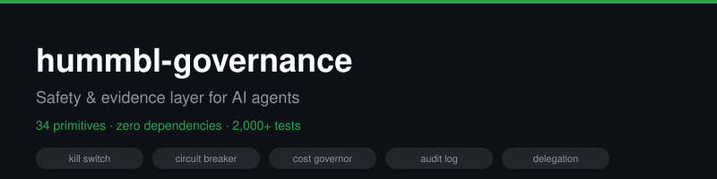
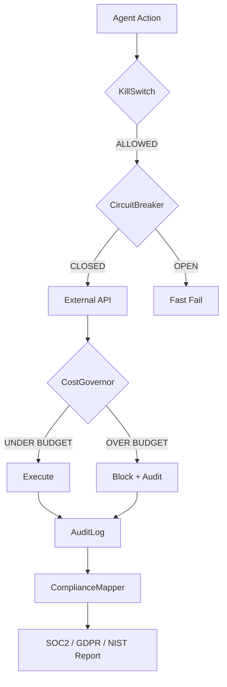

# hummbl-governance




[](https://pypi.org/project/hummbl-governance/)
[](https://pypi.org/project/hummbl-governance/)
[](https://github.com/hummbl-io/oss/actions/workflows/ci.yml)
[](LICENSE)
[]()
[](https://github.com/hummbl-io/oss/commits/main)

## The Problem

Your AI agent calls an API. The API starts returning errors. Your agent retries, and retries, and retries — burning through hundreds of dollars in API credits before anyone notices. Or worse: your agent decides to "optimize" and starts calling endpoints it was never supposed to touch.

Teams shipping AI agents can face runaway costs, cascading failures, unauthorized actions, and incomplete audit trails. General-purpose agent frameworks emphasize orchestration; their governance coverage varies by framework, version, and deployment, so teams still need to evaluate runtime controls explicitly.

**hummbl-governance** is a safety and evidence layer. It provides 36 governance primitives — kill switch, circuit breaker, cost governor, delegation tokens, audit log, identity registry, compliance mapping, and more — as a single stdlib-only Python package. It has no third-party runtime dependencies and no required orchestration framework.

The package is classified **Alpha** in `pyproject.toml`. Evaluate it against your own risk, security, and production-readiness requirements.

```bash
pip install hummbl-governance
```

## 30-Second Example

Stop a runaway agent in 5 lines:

```python
from hummbl_governance import KillSwitch, KillSwitchMode, CircuitBreaker, CostGovernor

# Kill switch: 4 graduated halt modes, survives process restart
ks = KillSwitch()
ks.engage(KillSwitchMode.HALT_NONCRITICAL, reason="Error rate > 50%", triggered_by="monitor")
ks.check_task_allowed("data_export")  # {"allowed": False, ...}

# Circuit breaker: auto-opens after 3 failures, auto-recovers
cb = CircuitBreaker(failure_threshold=3, recovery_timeout=10.0)
result = cb.call(lambda: 1 / 0)  # Raises ZeroDivisionError 3x, then fast-fails

# Cost governor: soft cap warns, hard cap blocks
gov = CostGovernor(":memory:", soft_cap=50.0, hard_cap=100.0)
gov.record_usage(provider="anthropic", model="claude-4", tokens_in=1000, tokens_out=500, cost=0.015)
gov.check_budget_status()  # .decision in ("ALLOW", "WARN", "DENY")
```

Every primitive works standalone. Use `KillSwitch` without pulling in `CostGovernor`. Use `CircuitBreaker` without the audit log. No framework lock-in.

## Design scope

The package combines runtime controls, identity and delegation, audit evidence,
and engineering mappings in one stdlib-only runtime. This is a description of
the package inventory, not a claim that competing projects lack equivalent
capabilities. Compare current versions and deployment requirements directly
before selecting a governance layer.

## Why hummbl-governance?

**No dependency conflicts.** Uses only Python stdlib at runtime. Installs without runtime dependency resolution overhead and avoids transitive runtime dependencies, reducing dependency supply-chain risk for a library that exists to make agents safer. The package itself, build backend, publishing path, CI, and optional/test tooling remain supply-chain surfaces that require normal review.

**Built for multi-agent systems.** Delegation tokens with HMAC-SHA256 signing and chain-depth limits. Coordination bus with flock-based mutual exclusion. Kill switch with 4 graduated halt modes. Circuit breakers wrapping external adapters. These are primitives that AI orchestration platforms need at runtime.

**Compliance-aware by design.** The `compliance_mapper` maps governance events to SOC2, GDPR, and OWASP controls. The `stride_mapper` produces STRIDE threat analysis for agent interactions. These modules generate audit evidence, not just runtime safety — evidence you can hand to an auditor or compliance team.

**Evidence-first.** Package metrics, cross-repo extraction notes, production-use statements, and framework mappings are governed by [docs/public-claims.md](docs/public-claims.md). Current package test inventory is verified by `python -m pytest --collect-only -q tests`.

**Sponsorship boundary.** The canonical draft sponsorship policy (in the HUMMBL OSS monorepo) does not sell support, priority, favorable findings, or roadmap control. Sponsorship is not active until its documented launch gates pass.

**OWASP Top 10 for Agentic Applications.** The README includes an engineering mapping to the [OWASP Top 10 for Agentic Applications (2026)](https://genai.owasp.org/resource/owasp-top-10-for-agentic-applications-for-2026/). It is not a third-party certification or attestation. See the [mapping below](#owasp-top-10-for-agentic-applications-2026-engineering-mapping).

## Quick Start

```bash
pip install hummbl-governance
```

**Integrate with your framework** (CrewAI, LangChain, AutoGen, raw OpenAI):
See [docs/integrations/README.md](docs/integrations/README.md) for copy-paste examples.

Explore all 34 primitives:

```bash
git clone https://github.com/hummbl-io/oss.git
cd oss/packages/hummbl-governance
python examples/kill_switch_modes.py
python examples/circuit_breaker_wrap.py
python examples/cost_governor.py
```

## Architecture



[]()
[]()

## Features

- **36 governance primitives** covering safety, cost, identity, compliance, reasoning, coordination, physical-AI, execution assurance, and governance Kernel
- **2314 collected tests** across package modules, as of the latest local receipt in [docs/public-claims.md](docs/public-claims.md)
- **Zero dependencies** -- Python stdlib only, no pip conflicts
- **Thread-safe** -- all modules use appropriate locking primitives
- **Independently importable** -- use only the modules you need
- **Python 3.11 - 3.13** CI-tested.

## governance.yml

Every HUMMBL package ships a `governance.yml` file declaring its governance posture — safety controls, cost limits, compliance frameworks, and build provenance. This is the first-class metadata artifact for the HUMMBL ecosystem.

```yaml
# hummbl_governance/governance.yml (shipped in the wheel)
package:
  name: hummbl-governance
  version: 1.4.0
  license: Apache-2.0

safety:
  kill_switch:
    supported: true
    default_mode: DISENGAGED
    modes_available: [DISENGAGED, HALT_NONCRITICAL, HALT_ALL, EMERGENCY]

cost:
  cost_governor:
    supported: true
    soft_cap_usd: 50.0
    hard_cap_usd: 100.0

provenance:
  build_system: github-actions
  trusted_publishing: true
  dependencies: zero
  tests: 2314
```

Read it at runtime (the file is human-readable YAML; parse with PyYAML if available, or read as text):

```python
from pathlib import Path

governance_file = Path(__file__).parent / "governance.yml"
text = governance_file.read_text()
# Parse with yaml.safe_load(text) if PyYAML is installed
# Or just inspect the raw YAML — it's designed to be human-readable
```

Every HUMMBL PyPI package includes `governance.yml` inside its wheel, giving consumers a machine- and human-readable statement of the package's declared governance posture.

## All 34 Primitives

### Core Primitives (26)

| Module | Description |
|--------|-------------|
| `kernel` | Governance operating system — receipts, identity, roles, laws, evidence, sequence, authority, schedule |
| `kill_switch` | Emergency halt system with 4 graduated modes (DISENGAGED, HALT_NONCRITICAL, HALT_ALL, EMERGENCY) |
| `circuit_breaker` | Automatic failure detection and recovery across 3 states (CLOSED, HALF_OPEN, OPEN) |
| `cost_governor` | Budget tracking with soft/hard caps and ALLOW/WARN/DENY decisions |
| `delegation` | HMAC-SHA256 signed capability tokens for agent delegation chains |
| `audit_log` | Append-only JSONL governance audit log with rotation and retention |
| `identity` | Agent registry with configurable aliases, trust tiers, and canonicalization |
| `schema_validator` | Stdlib-only JSON Schema validator (Draft 2020-12 subset) with top-level `ValidationError` export |
| `coordination_bus` | Append-only TSV message bus with flock locking and HMAC signing |
| `compliance_mapper` | Map governance traces to SOC2, GDPR, and OWASP controls |
| `health_probe` | Composable health probe framework with latency tracking |
| `output_validator` | Rule-based content validation for agent outputs (PII detection, injection detection, blocklists) |
| `capability_fence` | Soft sandbox enforcing capability boundaries per agent role |
| `stride_mapper` | Map agent interactions to STRIDE threat categories with mitigation suggestions |
| `lifecycle` | NIST AI RMF orchestrator composing kill switch, circuit breaker, cost governor, and audit log |
| `contract_net` | Market-based task allocation protocol for multi-agent systems |
| `convergence_guard` | Detect instrumental convergence patterns in agent behavior |
| `reward_monitor` | Behavioral drift and reward gaming detector |
| `lamport_clock` | Hardened logical clock for causal ordering of distributed agent events (v0.5.0) |
| `reasoning` | Structured governance reasoning engine with rule application, conflict detection, and decision tracing |
| `eal` | Execution Assurance Layer -- Arbiter-verified code quality in execution receipts |
| `physical_governor` | Kinematic constraints and pHRI safety modes for physical-AI deployments |
| `errors` | `HummblError`, `FailureMode`, and `fm_to_errors()` -- typed error taxonomy |
| `failure_modes` | Structured failure mode catalog with classification and error cross-reference |
| `evolution_lineage` | In-memory lineage tracking for eAI variants with drift detection |
| `ValidationError` | Top-level exception for schema validation failures (exported from `schema_validator`) |

### Kernel Sub-Primitives (8)

| Module | Invariant | Description |
|--------|-----------|-------------|
| `canon_registry` | — | Canonical operator approval registry for governance transitions |
| `rollback` | K9 | Rollback declaration validation with reversibility checks |
| `recovery_verifier` | K10 | Recovery verification with root-cause and operator approval validation |
| `receipt_integrity_monitor` | K11 | Sequence, hash-chain, and timestamp integrity checks for receipts |
| `contestability` | D6 | Contest status tracking with review outcome validation |
| `doctrine_amendment` | D7 | Doctrine amendment validation with operator approval and tier transitions |
| `authority_sweeper` | P34 | Authority sweep validation with revocation consistency checks |
| `trust_adjuster` | P36 | Trust tier adjustment validation with severity classification |

## Runnable Examples

Every primitive has a standalone example in `examples/`. Each runs with just `python examples/<name>.py` -- no setup, no config.

| Example | Primitive | What it shows |
|---------|-----------|---------------|
| `kill_switch_modes.py` | KillSwitch | 4 graduated halt modes |
| `circuit_breaker_wrap.py` | CircuitBreaker | 3-state failure recovery |
| `cost_governor.py` | CostGovernor | Soft/hard budget caps |
| `delegate_task.py` | DelegationToken | HMAC-signed agent delegation |
| `audit_log.py` | AuditLog | Append-only governance log |
| `agent_registry.py` | AgentRegistry | Identity + trust tiers |
| `schema_validator.py` | SchemaValidator | Stdlib JSON Schema validation |
| `compliance_mapper.py` | ComplianceMapper | SOC2/GDPR evidence mapping |
| `health_probe.py` | HealthProbe | Composable health checks |
| `output_validator.py` | OutputValidator | Content safety filtering |
| `capability_fence.py` | CapabilityFence | Role-based capability boundaries |
| `stride_mapper.py` | StrideMapper | STRIDE threat analysis |
| `lifecycle.py` | GovernanceLifecycle | NIST AI RMF orchestration |
| `contract_net.py` | ContractNetManager | Multi-agent task allocation |
| `convergence_guard.py` | ConvergenceGuard | Instrumental convergence detection |
| `behavior_monitor.py` | BehaviorMonitor | Behavioral drift detection |
| `lamport_clock.py` | LamportClock | Distributed causal ordering |
| `reasoning.py` | ReasoningEngine | Structured governance reasoning |
| `eal.py` | EAL | Execution assurance |
| `physical_governor.py` | KinematicGovernor | Physical-AI safety limits |
| `errors.py` | HummblError | Typed error taxonomy |
| `failure_modes.py` | FailureMode | Failure classification |
| `evolution_lineage.py` | EvolutionLineage | eAI variant lineage tracking |
| `agent_runner.py` | -- | End-to-end agent with governance stack |
| `failure_injection.py` | -- | Chaos testing with kill switch + circuit breaker |

Run them all:

```bash
for f in examples/*.py; do echo "=== $f ==="; python "$f"; done
```

## OWASP Top 10 for Agentic Applications (2026) Engineering Mapping

The table below maps hummbl-governance primitives to the [OWASP Top 10 for Agentic Applications](https://genai.owasp.org/resource/owasp-top-10-for-agentic-applications-for-2026/). This is an engineering evidence map, not a third-party certification or attestation. Most rows below link to a primitive and its test suite; ASI04 is a supply-chain posture row for the package runtime surface.

| OWASP Risk | Primitive(s) | Tests | How |
|------------|-------------|-------|-----|
| **ASI01** Agent Goal Hijack | [`KillSwitch`](hummbl_governance/kill_switch.py) | [27](tests/test_kill_switch.py) | 4-mode graduated shutdown (DISENGAGED → EMERGENCY). Survives process restart. Stops hijacked agents mid-execution. |
| **ASI02** Tool Misuse | [`CapabilityFence`](hummbl_governance/capability_fence.py) | [27](tests/test_capability_fence.py) | Allowlist/blocklist enforcement per tool. Agents cannot invoke tools outside their granted capabilities. |
| **ASI03** Identity & Privilege Abuse | [`DelegationTokenManager`](hummbl_governance/delegation.py), [`AgentRegistry`](hummbl_governance/identity.py) | [16](tests/test_delegation.py) + [26](tests/test_identity.py) | HMAC-signed scoped tokens with chain-depth limits. Identity registry with trust tiers and alias canonicalization. |
| **ASI04** Supply Chain | Zero third-party runtime dependencies | — | Stdlib-only runtime surface reduces transitive dependency exposure. Package, build, publishing, CI, and optional/test tooling still require normal supply-chain review. |
| **ASI05** Unexpected Code Execution | [`OutputValidator`](hummbl_governance/output_validator.py), [`InjectionDetector`](hummbl_governance/output_validator.py) | [49](tests/test_output_validator.py) | Prompt injection detection, blocked-term filtering, and content validation before agent output reaches downstream systems. |
| **ASI06** Memory & Context Poisoning | [`BusWriter`](hummbl_governance/coordination_bus.py), [`AuditLog`](hummbl_governance/audit_log.py) | [63](tests/test_coordination_bus.py) + [34](tests/test_audit_log.py) | Append-only governance bus with content hashing. Tamper-evident audit log. Poisoned entries are detectable. |
| **ASI07** Insecure Inter-Agent Comms | [`LamportClock`](hummbl_governance/lamport_clock.py), [`ContractNetManager`](hummbl_governance/contract_net.py) | [20](tests/test_lamport_clock.py) + [19](tests/test_contract_net.py) | Hardened logical clocks for causal ordering. Contract Net protocol for structured multi-agent task allocation with bid verification. |
| **ASI08** Cascading Failures | [`CircuitBreaker`](hummbl_governance/circuit_breaker.py), [`HealthProbe`](hummbl_governance/health_probe.py) | [17](tests/test_circuit_breaker.py) + [30](tests/test_health_probe.py) | CLOSED/HALF_OPEN/OPEN state machine isolates failing components. Health probes detect degradation before cascade. |
| **ASI09** Human-Agent Trust Exploitation | [`ReasoningEngine`](hummbl_governance/reasoning.py), [`ComplianceMapper`](hummbl_governance/compliance_mapper.py) | [7](tests/test_explain.py) + [112](tests/test_compliance_mapper.py) | Structured decision traces explain *why* a governance decision was made. Compliance mapping to NIST/ISO provides external validation anchor. |
| **ASI10** Rogue Agents | [`BehaviorMonitor`](hummbl_governance/reward_monitor.py), [`GovernanceLifecycle`](hummbl_governance/lifecycle.py) | [20](tests/test_reward_monitor.py) + [17](tests/test_lifecycle.py) | Jensen-Shannon divergence detects behavioral drift from baseline. Lifecycle FSM enforces PROVISIONED → ACTIVE → SUSPENDED → DECOMMISSIONED transitions. |

**Current posture:** 2314 collected tests, 36 implemented primitives, 7 MCP server entry points, and zero third-party runtime dependencies. Test-count and coverage claims require current receipts; see [docs/public-claims.md](docs/public-claims.md).

For the formal governance primitive underlying all 10 mitigations, see [The Governance Tuple](https://doi.org/10.5281/zenodo.19646940) (Bowlby, 2026).

## Research

The evidence base behind hummbl-governance is documented in the AI Slop Crisis research corpus (migrating to the [HUMMBL OSS monorepo](https://github.com/hummbl-io/oss)):

- **Why Libraries, Not Platforms** -- the architectural thesis behind stdlib-only, independently importable governance primitives
- **Vendor Comparison Table** -- how hummbl-governance compares to platform-locked alternatives across dependency count, modularity, and compliance coverage

## Newsletter

Subscribe to the **HUMMBL Slop Tracker** for monthly AI governance intelligence: [hummbl.substack.com](https://hummbl.substack.com)

Read [Issue #1](https://hummbl.substack.com/p/issue-1) for the inaugural edition.

## FAQ

### How do I add a kill switch to my AI agent system?

Install hummbl-governance and use the `KillSwitch` class. It provides 4 graduated modes: `DISENGAGED` (normal operation), `HALT_NONCRITICAL` (stop non-essential tasks), `HALT_ALL` (stop everything except monitoring), and `EMERGENCY` (immediate full shutdown). Call `ks.check_task_allowed("task_name")` before each agent action.

```python
from hummbl_governance import KillSwitch, KillSwitchMode
ks = KillSwitch()
ks.engage(KillSwitchMode.HALT_NONCRITICAL, reason="High error rate", triggered_by="monitor")
```

### How do I track AI API costs and enforce budget limits?

Use `CostGovernor` with soft and hard caps. Record each API call with `record_usage()`, then call `check_budget_status()` to get an ALLOW, WARN, or DENY decision. The soft cap triggers warnings; the hard cap blocks further spending.

```python
from hummbl_governance import CostGovernor
gov = CostGovernor(":memory:", soft_cap=50.0, hard_cap=100.0)
gov.record_usage(provider="openai", model="gpt-4", tokens_in=500, tokens_out=200, cost=0.02)
```

### How do I implement delegation tokens for multi-agent AI systems?

Use `DelegationTokenManager` to create HMAC-SHA256 signed tokens that grant specific operations to specific agents. Tokens are scoped by issuer, subject, allowed operations, and an optional binding to a task and contract. Validate tokens before executing delegated actions.

```python
from hummbl_governance import DelegationTokenManager
from hummbl_governance.delegation import TokenBinding
mgr = DelegationTokenManager(secret=b"shared-secret")
token = mgr.create_token(issuer="orchestrator", subject="worker", ops_allowed=["read", "write"],
                         binding=TokenBinding("task-1", "contract-1"))
valid, error = mgr.validate_token(token)
```

### Does hummbl-governance work without any third-party packages?

Yes. Every runtime module uses only Python stdlib (3.11+). There are zero entries in the `dependencies` list in `pyproject.toml`. Test dependencies are isolated under `project.optional-dependencies.test` in `pyproject.toml`. This means no runtime dependency conflicts, reduced transitive dependency risk, and fast installs.

### How do I generate compliance evidence for SOC2 or GDPR from my AI system?

Use `ComplianceMapper` to map governance audit log entries to compliance framework controls. Pass your `AuditLog` entries through the mapper to produce a `ComplianceReport` that links each governance event to the relevant SOC2, GDPR, or OWASP control. Use `StrideMapper` for threat-level analysis of agent interactions.

```python
from hummbl_governance import ComplianceMapper, AuditLog
mapper = ComplianceMapper()
report = mapper.map_events(audit_entries)  # Returns ComplianceReport with control mappings
```

## Multi-Agent Example

Delegation tokens and agent identity for multi-agent systems:

```python
from hummbl_governance import DelegationTokenManager, AgentRegistry
from hummbl_governance.delegation import TokenBinding

# Agent registry: identity + trust tiers
registry = AgentRegistry()
registry.register_agent("orchestrator", trust="high")
registry.register_agent("worker-1", trust="medium")
registry.add_alias("orch-1", "orchestrator")
registry.canonicalize("orch-1")  # -> "orchestrator"

# Delegation tokens: HMAC-signed, scoped, chain-depth-limited
mgr = DelegationTokenManager(secret=b"shared-secret")
token = mgr.create_token(
    issuer="orchestrator", subject="worker-1",
    ops_allowed=["read", "write"],
    binding=TokenBinding("task-1", "contract-1"),
)
valid, error = mgr.validate_token(token)  # (True, None)

# Worker can now prove it's authorized for "read"/"write" on "task-1"
# Token is tamper-evident — any modification invalidates the signature
```

## MCP Servers

hummbl-governance ships three [Model Context Protocol](https://modelcontextprotocol.io/) servers that expose governance primitives as tools to any MCP-compatible client (Claude Code, Claude Desktop, etc.).

### hummbl-governance (core)

```json
{
  "mcpServers": {
    "hummbl-governance": {
      "command": "python",
      "args": ["/path/to/hummbl-governance/mcp_server.py"],
      "env": {
        "GOVERNANCE_STATE_DIR": "/path/to/state"
      }
    }
  }
}
```

**10 tools:** `governance_status`, `kill_switch_status`, `kill_switch_engage`, `kill_switch_disengage`, `circuit_breaker_status`, `cost_budget_check`, `cost_record_usage`, `audit_query`, `compliance_report`, `health_check`

### hummbl-compliance

```json
{
  "mcpServers": {
    "hummbl-compliance": {
      "command": "python",
      "args": ["/path/to/hummbl-governance/mcp_compliance.py"],
      "env": {
        "GOVERNANCE_AUDIT_DIR": "/path/to/audit"
      }
    }
  }
}
```

**5 tools:** `nist_map_controls`, `soc2_assess`, `iso_crosswalk`, `stride_analysis`, `compliance_evidence_export`

### hummbl-sandbox

```json
{
  "mcpServers": {
    "hummbl-sandbox": {
      "command": "python",
      "args": ["/path/to/hummbl-governance/mcp_sandbox.py"],
      "env": {
        "SANDBOX_STATE_DIR": "/path/to/sandbox"
      }
    }
  }
}
```

This server is part of `hummbl-governance` and is launched through the
`hummbl-sandbox-mcp` entry point. It is not related to the third-party npm
package named `agent-sandbox`.

**5 tools:** `sandbox_create`, `sandbox_check`, `sandbox_validate_output`, `sandbox_status`, `sandbox_destroy`

All three servers use stdio JSON-RPC and have zero third-party dependencies.

## Design Principles

- **Zero third-party runtime dependencies** -- stdlib only (Python 3.11+)
- **Thread-safe** -- all modules use appropriate locking
- **Configurable** -- no hardcoded agent names or paths
- **Independently importable** -- each module works standalone

## Development

```bash
python -m venv .venv && source .venv/bin/activate
pip install -e ".[test]"
python -m pytest tests/ -v
```

## HUMMBL Ecosystem

This package is part of the [HUMMBL](https://hummbl.io) cognitive AI architecture. Public packages are consolidating into the [HUMMBL OSS monorepo](https://github.com/hummbl-io/oss). Related packages:

| Package | Purpose |
|---------|---------|
| `hummbl-governance` | Governance primitives for AI agent orchestration (this package) |
| `hummbl-bus` | Secure append-only TSV coordination bus for multi-agent systems |
| `hummbl-cognition` | Cognitive Ledger Protocol (CLP) and Open Brain server |
| `hummbl-tuples` | HUMMBL Typed Tuples governance model |
| `hummbl-bif` | Batch Ingestion Framework for technical knowledge acquisition |

## Links

- [PyPI](https://pypi.org/project/hummbl-governance/)
- [GitHub (OSS monorepo)](https://github.com/hummbl-io/oss)
- [hummbl.io](https://hummbl.io)
- [Linktree](https://linktr.ee/hummbl)
- [HUMMBL Slop Tracker (Substack)](https://hummbl.substack.com)

## License

Dual-licensed under MIT OR Apache-2.0. See [LICENSE](LICENSE), [LICENSE-MIT](LICENSE-MIT), and [LICENSE-APACHE](LICENSE-APACHE).


---

## Author

**Reuben Bowlby** — Founder, [HUMMBL](https://github.com/hummbl-io)

- GitHub: [@hummbl-io](https://github.com/hummbl-io)
- X/Twitter: [@ReubenBowlby](https://x.com/ReubenBowlby)
- LinkedIn: [reuben-bowlby](https://www.linkedin.com/in/reuben-bowlby/)
- Website: [hummbl.io](https://www.hummbl.io)
