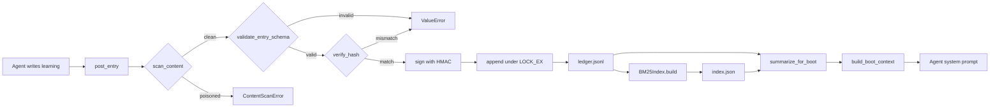

# Architecture

This document describes the HUMMBL Cognitive Ledger Protocol's three-layer
architecture, its append-only JSONL storage design, the platform-adaptive file
locking that makes concurrent multi-agent writes safe, and the BM25 indexing
pipeline. Every claim is grounded in the package source
(`hummbl_cognition/*.py`).

## The three layers

The protocol is defined in the package docstring (`__init__.py:1-14`) as three
cooperating layers, each backed by a file in the cognition directory
(default `hummbl_governance/_state/cognition/`):

| Layer | File | Mutability | Module |
|---|---|---|---|
| **Shared State** | `state.json` | Mutable snapshot of who is doing what | `boot_context.py` (reads it) |
| **Shared Memory** | `ledger.jsonl` | Append-only learning log | `ledger_writer.py`, `query.py`, `indexer.py` |
| **Shared Intent** | `intent.md` | Human-authored goals and priorities | `boot_context.py` (reads it) |

`build_boot_context()` (`boot_context.py:138-235`) is the single function that
unifies all three into one markdown string for agent injection. It reads them in
a deliberate order:

1. **Intent** (`boot_context.py:164-174`) — `intent.md` is read verbatim under a
   `## Current Intent` heading.
2. **State** (`boot_context.py:176-213`) — `state.json` is parsed into a
   `SharedState` and rendered as sprint name, active agents (with status),
   claimed files (with agent and purpose), and flags.
3. **Shared Memory** (`boot_context.py:214-229`) — recent active ledger entries
   are summarized, trying the BM25 index first (`_summarize_indexed`,
   `boot_context.py:47-108`) and falling back to a sequential scan
   (`summarize_for_boot`, `query.py:82-129`).

### Frozen snapshot contract

Boot context is computed **once** at session start and is immutable for the
session's lifetime (`boot_context.py:7-17`). This is intentional:

- It keeps the LLM's prefix cache stable across the conversation.
- It prevents mid-conversation reasoning from being invalidated by concurrent
  writes from other agents.
- It matches the "frozen snapshot" agent pattern.

Ledger writes that occur mid-session are persisted to disk immediately (via
`post_entry`) but are **not** reflected in the running session's boot context.
The next session will see them.

### Data flow diagram

```
                 ┌─────────────────────────────────────────────┐
                 │            cognition directory               │
                 │                                             │
   Human authored│  intent.md ─────────────┐                   │
                 │                          ├─► build_boot_context() ─► markdown
   Mutable       │  state.json ────────────┤    (boot_context.py)       (inject
   snapshot      │                          │                             once)
                 │                          │
   Append-only   │  ledger.jsonl ──────────┤                   │
                 │        │                │                   │
                 │        ▼                │                   │
                 │  index.json (derived) ──┘                   │
                 │  retrieval_log.jsonl                        │
                 └─────────────────────────────────────────────┘
```



## Append-only JSONL design

The ledger is a single text file with one JSON object per line
(`ledger_writer.py:1-8`). The design mirrors a coordination-bus writer and
deliberately avoids a database:

- **No mutation.** Entries are never edited or deleted. Corrections are *new*
  entries whose `supersedes` field points at the superseded entry's ID
  (`query.py:41-61`). `active_entries()` reconstructs current truth by removing
  every ID that appears as a `supersedes` target.
- **Line-atomic appends.** Each `post_entry` writes exactly one line plus a
  trailing newline (`ledger_writer.py:603`), then `flush()`es before releasing
  the lock (`ledger_writer.py:611-613`). On POSIX, appends smaller than
  `PIPE_BUF` (4096 here, `MAX_CONTENT_BYTES`, `ledger_writer.py:45`) are atomic
  at the syscall level, so concurrent writers cannot tear a single line.
- **Content cap.** Entry content is hard-limited to 4096 characters
  (`ledger_writer.py:505-506`), matching the schema `maxLength` and keeping
  every line within the atomic-append budget.
- **Self-describing.** Every line carries `id`, `timestamp`, `agent`, `vendor`,
  `model`, `type`, `scope`, `content`, and `content_hash`, so the file is
  fully usable without any external index (`ledger_writer.py:475-476`).
- **Derived artifacts are disposable.** The BM25 index (`index.json`) and the
  retrieval log (`retrieval_log.jsonl`) can always be rebuilt from the ledger;
  only `ledger.jsonl` is a source of truth (`indexer.py:1-7`).

### Integrity guarantees

- **Content hash.** Each entry stores a SHA-256 `content_hash`.
  `validate_integrity()` (`ledger_writer.py:798-860`) re-computes and compares
  it for every line; mismatches are reported as `content_hash_mismatch`. Entries
  with grandfathered non-hex hashes are skipped, not failed
  (`ledger_writer.py:835-842`).
- **HMAC signatures.** When `BUS_SIGNING_SECRET` (≥ 32 bytes) is set, entries
  are signed at write time (`ledger_writer.py:594-601`). Verification uses
  `hmac.compare_digest` to prevent timing attacks (`ledger_writer.py:631-658`).
  `read_entries(verify_signatures=True)` drops entries whose signature fails
  (`ledger_writer.py:758-777`).
- **Structured reports.** `validate_integrity_report()` (`ledger_writer.py:901-964`)
  classifies errors into `signature_mismatch`, `content_hash_mismatch`,
  `parse_error`, and `other`, groups consecutive line numbers into ranges, and
  attaches remediation guidance (`_REMEDIATION`, `ledger_writer.py:881-898`).

## File locking mechanism

Mutual exclusion is provided by `_lock_file` / `_unlock_file`
(`ledger_writer.py:49-71`), reused verbatim in `feedback_tracker.py:34-56`.

```
                ┌──────────────────────────────────────┐
   post_entry   │ open(path, "a")                      │
        │       │ ┌─ _lock_file(f)                     │
        │       │ │   fcntl available? ──► flock(EX)   │  POSIX
        │       │ │   else msvcrt available? ─► LK_LOCK│  Windows
        │       │ │   else ──► warn, proceed unlocked  │
        │       │ ├─ f.write(line); f.flush()          │
        │       │ └─ _unlock_file(f)                   │
        │       │   fcntl ──► flock(UN)                │
        │       │   msvcrt ──► LK_UNLCK                │
                └──────────────────────────────────────┘
```

Key properties:

- **Advisory, not mandatory.** `fcntl.flock` is a cooperative lock. Every
  writer must go through `post_entry` (or honor the same lock) to be excluded.
  A raw `open(..., "a")` bypasses it.
- **Exclusive (write) only.** The protocol uses `LOCK_EX` for appends and
  `LOCK_UN` for release. Readers (`read_entries`, `validate_integrity`) do not
  take a lock — they tolerate concurrent appends because lines are atomic.
- **Flush-then-unlock.** Data is `flush()`ed to the OS buffer before the lock
  is released (`ledger_writer.py:611-613`), so a reader cannot observe a
  partial line.
- **Windows span.** `msvcrt.locking` locks a 1-byte span at offset 0
  (`_WINDOWS_LOCK_SPAN = 1`, `ledger_writer.py:46`), after a `flush()` and
  `seek(0)`.
- **Permission hardening.** New ledger files are chmod'd to `0o660`
  (`ledger_writer.py:451-460`), restricting access to owner and group.

## Concurrency model

The protocol supports **many concurrent writers** (different agents on the same
or different machines sharing a filesystem) and **unlimited concurrent readers**:

- Writers serialize on the advisory lock; each holds it only for the duration of
  one line append + flush (microseconds), so contention is minimal.
- Readers never block writers and are never blocked by them. They parse line by
  line and skip malformed lines with a warning (`ledger_writer.py:751-756`), so
  a partially written line (only possible if a writer crashed mid-flush before
  the lock-based design — rare) is tolerated, not fatal.
- The retrieval log (`feedback_tracker.py`) uses the identical lock pattern, so
  retrieval-event appends from many agents are also safe.

For **cross-machine** coordination where a shared filesystem is not available,
the `OpenBrainClient` (`client.py`) federates to a primary server over HTTP
(see [API Reference](../reference/api-reference.md) → `OpenBrainClient`).

## BM25 indexing pipeline

The indexer (`indexer.py`) builds a searchable inverted index over the ledger
using stdlib-only BM25 scoring.

### Build

`BM25Index.build()` (`indexer.py:94-155`):

1. Reads all entries via `read_entries(limit=999_999)`.
2. For each entry, concatenates `content`, `type`, `scope`, `agent`, and
   space-joined `tags` into searchable text (`indexer.py:115-122`).
3. Tokenizes with `tokenize()` (`indexer.py:46-49`): lowercases, matches
   `[a-z0-9_]+(?:\.[a-z0-9_]+)*`, drops stopwords (`_STOPWORDS`,
   `indexer.py:34-41`) and single-character tokens.
4. Builds an inverted index `term → [(entry_id, term_frequency), ...]`
   (`indexer.py:142-146`), records `doc_lengths`, and stores `doc_meta`
   (timestamp, agent, type, scope, confidence, 200-char content preview, tags,
   links) (`indexer.py:129-139`).
5. Computes `avg_doc_length` and a `built_at` timestamp.

### Search

`BM25Index.search()` (`indexer.py:157-224`):

1. Tokenizes the query.
2. For each query term, looks up postings and computes IDF:
   `log((N - n + 0.5) / (n + 0.5) + 1)` (`indexer.py:183-186`).
3. Scores each document with the BM25 term score using `k1=1.5`, `b=0.75`
   (`indexer.py:190-195`).
4. Applies a **stigmergic boost**: entries retrieved more often get up to +20%
   (`indexer.py:198-206`), fed by `record_retrieval()` and the retrieval log.
5. Filters by `scope`, `entry_type`, and `since` against stored metadata
   (`indexer.py:208-220`).
6. Sorts by score descending and truncates to `limit`.

### Persistence

`save()` (`indexer.py:253-289`) is crash-safe: `tempfile.mkstemp` in the target
directory, `json.dump`, `flush`, `fsync`, then atomic `os.replace`. On any
exception the temp file is unlinked (`indexer.py:283-286`). `load()`
(`indexer.py:291-324`) restores all structures, returning `False` if the file is
missing or corrupt.

### Incremental updates

`add_document()` (`indexer.py:232-251`) adds a single document without a full
rebuild, incrementally updating `avg_doc_length`. This is useful for keeping the
index fresh between full `build()` passes.

## Nightly consolidation

`consolidator.py` compresses the ledger without losing information. It is
strictly append-only and idempotent (`consolidator.py:11-16`):

1. **Filter** to unconsolidated entries (those not linked from an existing
   `consolidated` entry, `_get_consolidated_ids`, `consolidator.py:104-112`).
2. **Group by links** — connected components of entries that link to each other
   form episodic groups (`_group_by_links`, `consolidator.py:145-191`).
3. **Group by similarity** — remaining unlinked entries are grouped by Jaccard
   token overlap ≥ 0.13 (`SIMILARITY_THRESHOLD`, `consolidator.py:47`) using
   greedy clustering (`_group_similar`, `consolidator.py:194-235`).
4. **Synthesize** each group via Ollama (`_synthesize_group`,
   `consolidator.py:238-260`), falling back to concatenation if Ollama is down.
5. **Post** a new `convention` entry with `tags: ["consolidated", ...]` and
   `links` pointing at the source entry IDs (`consolidator.py:345-356`).

A kill-switch gate (`_is_kill_switch_engaged`, `consolidator.py:88-101`) is
checked before the run and before each LLM call; if engaged, consolidation
aborts safely. The run is capped at `MAX_CONSOLIDATIONS_PER_RUN = 20`
(`consolidator.py:48`).

## Module dependency graph

```
__init__.py  (facade — re-exports public API)
    │
    ├── boot_context.py ─► query.py ─► ledger_writer.py ─► models (LedgerEntry…)
    │        └──────────► indexer.py ─► ledger_writer.py
    ├── indexer.py ─► ledger_writer.py
    ├── consolidator.py ─► indexer.py, ledger_writer.py
    ├── feedback_tracker.py  (standalone append-only log)
    └── client.py  (standalone HTTP client)
```

`ledger_writer.py` is the foundation: every other module that touches the
ledger reads through `read_entries()` and writes through `post_entry()`.
